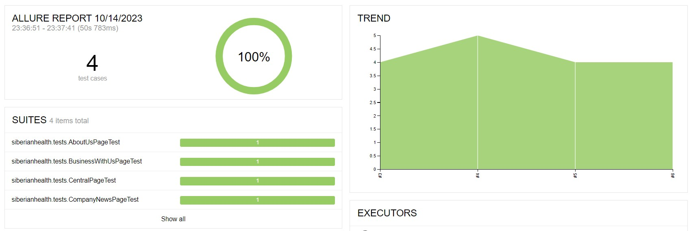

# Проект по автоматизации тестовых сценариев для сайта компании [Сибирское здоровье](https://siberianhealth.com/ru))

[](https://siberianhealth.com/ru)

## Содержание:
+ [Стек технологий](#стек-технологий)  
+ [Тестовые сценарии](#Тестовые-сценарии)
+ [Сборка в Jenkins](#Сборка-в-Jenkins)
+ [Команды запуска тестов в терминале](#Команды-запуска-тестов-в-терминале)
+ [Интеграция с Allure report](#Интеграция-с-Allure-report)
+ [Видео прохождения тестов](#cinema-Пример-видео-прохождения-тестов)
+ [Интеграция с Jira](#-Интеграция-с-Jira)
+ [Информирование в Telegram](#Информирование-в-Telegram)

## <a name="стек-технологий"></a>Стек технологий
<p align="center">
<a href="https://www.java.com/"></a>
<a href="https://github.com/"></a>
<a href="https://www.jetbrains.com/idea/"></a>
<a href="https://gradle.org/"></a>
<a href="https://selenide.org/"></a>
<a href="https://junit.org/junit5/"></a>
<a href="https://aerokube.com/selenoid/"></a>
<a href="https://www.jenkins.io/"></a>
<a href="https://github.com/allure-framework/allure2"></a>
<a href="https://telegram.org/"></a>
</p>

## <a name="Тестовые-сценарии"></a>Тестовые сценарии
- Проверка центральной страницы
- Проверка шапки сайта
- Проверка страницы "О нас"
- Проверка стараницы "Новости компании"
- Проверка старинцы "Начни бизнес с нами"

## <a name="Сборка-в-Jenkins"></a>Сборка в [Jenkins](https://jenkins.autotests.cloud/job/sveta_siberianhealth_com_test/)

<p align="center">

</p>

### Параметры сборки проекта

| Параметр        | Назначение                               |
|-----------------|------------------------------------------|
| TASK            | Опция выбора запуска определённых тестов |
| SELENOID_URL    | Удаленный сервер для запуска тестов      |
| BROWSER         | Браузер для запуска                      |
| BROWSER_VERSION | Версия браузера                          |
| BROWSER_SIZE    | Разрешение экрана                        |
| COMMENT         | Комментарий                              |

## <a name="Команды-запуска-тестов-в-терминале"></a>Команды запуска тестов в терминале
```bash
gradle clean
${TASK}
-DbrowserServer=${BROWSER_SERVER}
-DserverCreds=${SERVER_CREDS}
-Dbrowser=${BROWSER}
-DbrowserVersion=${BROWSER_VERSION}
-DbrowserSize=${BROWSER_SIZE}
```

## <a name="Интеграция-с-Allure-report"></a>Интеграция с [Allure report](https://jenkins.autotests.cloud/job/sveta_siberianhealth_com_test/6/allure/)

### Главная страница отчета
<p align="center">

</p>

### Тест-кейсы

<p align="center">

</p>

### Графики

<p align="center">

</p>

## <a name="Информирование-в-Telegram"></a>Информирование в Telegram

### Уведомление из переписки с чат ботом

<p align="center">

</p>


#### Содержание уведомления в Telegram

- Проект
- Комментарий
- Длительность прохождения тестов
- Общее количество сценариев
- Процент прохождения тестов
- Ссылка на Allure отчет
