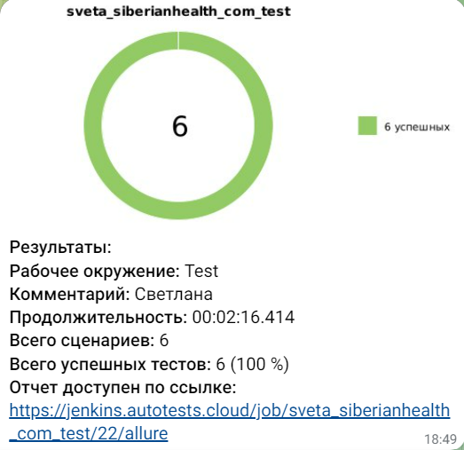

# Проект по автоматизации тестовых сценариев для сайта компании [Сибирское здоровье](https://siberianhealth.com/ru)

[](https://siberianhealth.com/ru)

## Содержание:
+ [Стек технологий](#стек-технологий)  
+ [Тестовые сценарии](#Тестовые-сценарии)
+ [Запуск теста из терминала](#запуск-теста-из-терминала)
+ [Сборка в Jenkins](#Сборка-в-Jenkins)
+ [Интеграция с Allure report](#Интеграция-с-Allure-report)
+ [Информирование в Telegram](#Информирование-в-Telegram)
+ [Пример прогона теста в Selenoid](#пример-прогона-теста-selenoid)
+ [Интеграция с Allure TestOps](#интеграция-allure-testops)
+ [Интеграция с Jira](#интеграция-jira)

## <a name="стек-технологий"></a>Стек технологий:
<p align="center">
<a href="https://www.java.com/"></a>
<a href="https://github.com/"></a>
<a href="https://www.jetbrains.com/idea/"></a>
<a href="https://gradle.org/"></a>
<a href="https://selenide.org/"></a>
<a href="https://junit.org/junit5/"></a>
<a href="https://aerokube.com/selenoid/"></a>
<a href="https://www.jenkins.io/"></a>
<a href="https://github.com/allure-framework/allure2"></a>
<a href="https://telegram.org/"></a>
<a href="https://jira.autotests.cloud/browse/HOMEWORK-1001"></a>
<a href="https://jira.autotests.cloud/browse/HOMEWORK-1001"></a>
</p>

`Gradle` - используется как инструмент автоматизации сборки.  \
`JUnit5` - для выполнения тестов.\
`Selenide` - это фреймворк для автоматизированного тестирования веб-приложений на основе Selenium WebDriver.\
`Jenkins` - CI/CD для запуска тестов удаленно.\
`Allure Report` - для визуализации результатов тестирования.\
`Telegram Bot` - для уведомлений о результатах тестирования.\
`Allure Report` - нструмент для создания отчетов об автоматизированных тестах.
`Allure TestOps` - как система управления тестированием.

## <a name="Тестовые-сценарии"></a>Тестовые сценарии:
- Проверка центральной страницы
- Проверка шапки сайта
- Проверка страницы "О нас"
- Проверка страницы "Новости компании"
- Проверка страницы "Начни бизнес с нами"
- Проверка страницы с товаром
  
## <a name="запуск-теста-из-терминала"></a>Запуск теста из терминала:

```
gradle clean test  
```

## <a name="Сборка-в-Jenkins"></a>Сборка в [Jenkins](https://jenkins.autotests.cloud/job/sveta_siberianhealth_com_test/):

Для запуска необходимо нажать "Build with Parameters":

<p align="center">

</p>

### Параметры сборки проекта:

| Параметр        | Назначение                               |
|-----------------|------------------------------------------|
| BASE_URL        | Адрес тестируемого сайта                 |
| BROWSER         | Браузер для запуска                      |
| BROWSER_VERSION | Версия браузера                          |
| BROWSER_SIZE    | Разрешение экрана                        |
| COMMENT         | Комментарий                              |
| REMOTE_URL      | Удаленный сервер для запуска тестов      |

## <a name="Интеграция-с-Allure-report"></a>Интеграция с [Allure report](https://jenkins.autotests.cloud/job/sveta_siberianhealth_com_test/allure/):

### Главная страница отчета:
<p align="center">

</p>

### Тест-кейсы:

<p align="center">

</p>

## <a name="Информирование-в-Telegram"></a>Информирование в Telegram:

### Уведомление из переписки с чат ботом:

<p align="center">

</p>


### Содержание уведомления в Telegram:

- Проект
- Комментарий
- Длительность прохождения тестов
- Общее количество сценариев
- Процент прохождения тестов
- Ссылка на Allure отчет

## <a name="пример-прогона-теста-selenoid"></a>Пример прогона теста в Selenoid:
Видео к прохождению теста "Checking the products page":
<p align="center">

</p>

## <a name="интеграция-allure-testops">Интеграция с [Allure TestOps](https://allure.autotests.cloud/project/3877/dashboards):</a>
> Ссылка доступна только авторизованным пользователям.

<p align="center">

</p>

## <a name="интеграция-jira">Интеграция с [Jira](https://jira.autotests.cloud/browse/HOMEWORK-1001):</a>

<p align="center">

</p>
